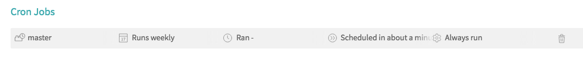
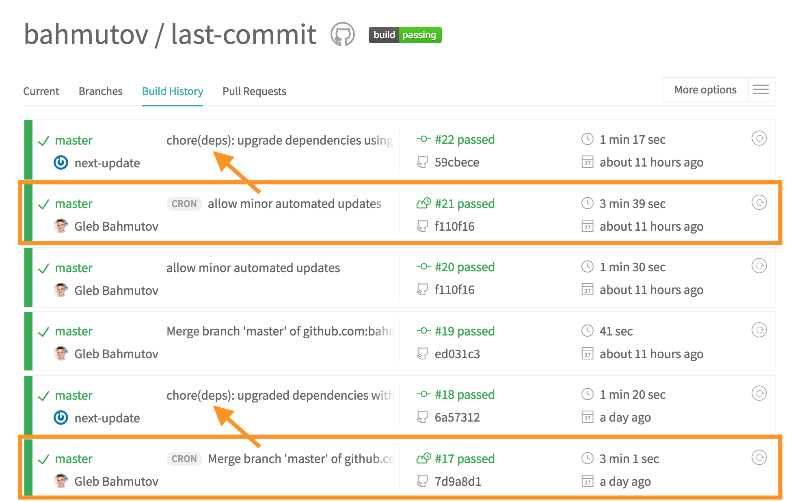

# next-update-travis

[![next-update-travis badge][badge]][readme]

> Safely update your dependencies using TravisCI cron jobs

[![NPM][npm-icon] ][npm-url]

[![Build status][ci-image] ][ci-url]
[![semantic-release][semantic-image] ][semantic-url]
[![js-standard-style][standard-image]][standard-url]

## Install

Requires [Node](https://nodejs.org/en/) version 6 or above.

```sh
npm install --save-dev next-update-travis
```

This will create file `next-update-travis.sh` you can tweak. If you need to
reinstall (because new version of `next-update-travis` is available), just
remove the file and install again

```sh
rm next-update-travis.sh
npm i next-update-travis
```

It is highly recommended to set up `next-update-travis` *after*
[enabling semantic release][sem setup] on Travis CI.

## Use

Take any Node project and install `next-update-travis` as a dev dependency.
This will create a shell script file `next-update-travis.sh` in the project.
Add this script to your `.travis.yml` `script` step.

```yaml
script:
  - ./next-update-travis.sh
  - npm test
```

Then enable a [cron job][cron job] on Travis. `next-update-travis.sh` skips
running its command automatically for non-cron jobs.



That's it.

**Important**

If there are dependencies that the `next-update-travis.sh` could safely
upgrade, it will commit and push the change back to GitHub using `GH_TOKEN`
for authentication. The simplest way to set this token is by using
[semantic-release][semantic-release], see [it's setup][sem setup].

[cron job]: https://docs.travis-ci.com/user/cron-jobs/
[semantic-release]: https://github.com/semantic-release/semantic-release
[sem setup]: https://github.com/semantic-release/semantic-release#setup

Cron job will run, and if dependencies can be successfully upgraded, the
update will be pushed (triggering normal Travis build). It will look
something like this in the build history



## Options

You can tweak which updates are checked by editing `next-update-travis.sh`
script. Under the hood it uses [next-update][next-update] to check dependencies.
For example, to only consider patches (fixes) you can modify the shell command
to be

```sh
next-update --allow patch
```

[next-update]: https://github.com/bahmutov/next-update

## Badge

Let other people know that your module is periodically updated with this
Markdown SVG badge

```
[![next-update-travis badge][badge]][readme]
[badge]: https://img.shields.io/badge/next--update--travis-%E2%9C%94%EF%B8%8F-green.svg
[readme]: https://github.com/bahmutov/next-update-travis#readme
```

## FAQ

<details>
<summary>Why do you hate <a href="https://greenkeeper.io/">greenkeeper.io</a>?</summary>
<br>
I ♥️ Greenkeeper! And I use <a href="https://github.com/semantic-release/semantic-release">semantic-release</a>
on <b>every single one</b> of my NPM packages. But Greenkeeper is too scared to
merge suggested dependency updates, creating so many pull requests ...
I want less noise and fully automated solution; with options to control which
modules are tested, how and the global update stats, I feel we finally can
take the human out of the loop.
<hr>
</details>

<details>
<summary>What if my tests are not comprehensive enough to feel safe?</summary>
<br>
You can control which modules <a href="https://github.com/bahmutov/next-update#checking-specific-modules">are checked</a> or <a href="https://github.com/bahmutov/next-update#ignoring-or-skipping-some-modules">skipped</a>
<hr>
</details>

<details>
<summary>"npm test" is not my testing command</summary>
<br>
You can use a different command and even a custom command per module,
see <a href="https://github.com/bahmutov/next-update#custom-test-command-per-module">docs</a>
<hr>
</details>

<details>
<summary>I only want to test and update to dependencies that others have successfully tested</summary>
<br>
<code>next-update</code> uses public anonymous <a href="https://github.com/bahmutov/next-update#anonymous-usage-collection">statistics</a> to show success
percentage for each specific update.
When <a href="https://github.com/bahmutov/next-update/issues/107">bahmutov/next-update#107</a> is implemented
it will be possible to automatically upgrade only the packages that were
successfully upgraded by others 100% of the time for example.
<hr>
</details>

<details>
<summary>Help, it updated dependencies and published new broken version!</summary>
<br>
Hmm, <code>next-update-travis</code> commits its change with
<code>chore(deps): ...</code> message,
which should NOT publish new NPM version according to semantic versioning
convention. Well, the beauty of Git is that you can always roll back the
commit and then
<a href="https://github.com/bahmutov/next-update#ignoring-or-skipping-some-modules">blacklist</a>
the specific modules that are causing problems.
<hr>
</details>

### Small print

Author: Gleb Bahmutov &lt;gleb.bahmutov@gmail.com&gt; &copy; 2017

* [@bahmutov](https://twitter.com/bahmutov)
* [glebbahmutov.com](https://glebbahmutov.com)
* [blog](https://glebbahmutov.com/blog)

License: MIT - do anything with the code, but don't blame me if it does not work.

Support: if you find any problems with this module, email / tweet /
[open issue](https://github.com/bahmutov/next-update-travis/issues) on Github

## MIT License

Copyright (c) 2017 Gleb Bahmutov &lt;gleb.bahmutov@gmail.com&gt;

Permission is hereby granted, free of charge, to any person
obtaining a copy of this software and associated documentation
files (the "Software"), to deal in the Software without
restriction, including without limitation the rights to use,
copy, modify, merge, publish, distribute, sublicense, and/or sell
copies of the Software, and to permit persons to whom the
Software is furnished to do so, subject to the following
conditions:

The above copyright notice and this permission notice shall be
included in all copies or substantial portions of the Software.

THE SOFTWARE IS PROVIDED "AS IS", WITHOUT WARRANTY OF ANY KIND,
EXPRESS OR IMPLIED, INCLUDING BUT NOT LIMITED TO THE WARRANTIES
OF MERCHANTABILITY, FITNESS FOR A PARTICULAR PURPOSE AND
NONINFRINGEMENT. IN NO EVENT SHALL THE AUTHORS OR COPYRIGHT
HOLDERS BE LIABLE FOR ANY CLAIM, DAMAGES OR OTHER LIABILITY,
WHETHER IN AN ACTION OF CONTRACT, TORT OR OTHERWISE, ARISING
FROM, OUT OF OR IN CONNECTION WITH THE SOFTWARE OR THE USE OR
OTHER DEALINGS IN THE SOFTWARE.

[npm-icon]: https://nodei.co/npm/next-update-travis.svg?downloads=true
[npm-url]: https://npmjs.org/package/next-update-travis
[ci-image]: https://travis-ci.org/bahmutov/next-update-travis.svg?branch=master
[ci-url]: https://travis-ci.org/bahmutov/next-update-travis
[semantic-image]: https://img.shields.io/badge/%20%20%F0%9F%93%A6%F0%9F%9A%80-semantic--release-e10079.svg
[semantic-url]: https://github.com/semantic-release/semantic-release
[standard-image]: https://img.shields.io/badge/code%20style-standard-brightgreen.svg
[standard-url]: http://standardjs.com/

[badge]: https://img.shields.io/badge/next--update--travis-%E2%9C%94%EF%B8%8F-green.svg
[readme]: https://github.com/bahmutov/next-update-travis#readme
